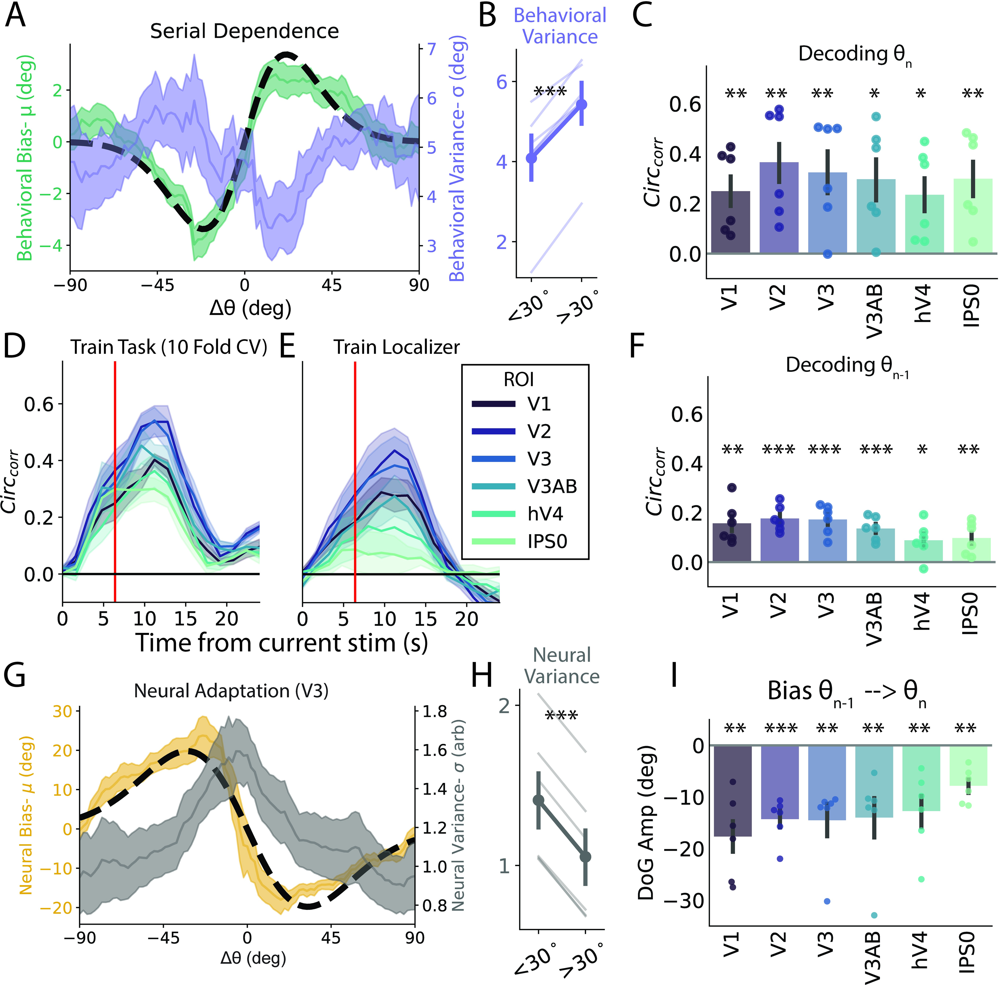

# Sheehan & Serences 2022

[Attractive serial dependence overcomes repulsive neuronal adaptation](https://journals.plos.org/plosbiology/article?id=10.1371/journal.pbio.3001711)

([Commentary](https://journals.plos.org/plosbiology/article?id=10.1371/journal.pbio.3001788))

**Tags:** *perception*, *neural decoding*, *custom model fitting*, *dimensionallity analysis*.
**Tools Used:** *regression*, *mixed-effects linear model*, *regularization*, *cross-validation*, *PCA*, *deconvolution*.
**Packages Used:** *matplotlib*, *pandas*, *seaborn*, *scipy*, *numpy*, *scikit-learn*, *statsmodels*.

## Summary

With this project, I examined a tendency for human observers to perceive the world as more stable than it actually is -- *serial dependence*. We first [demonstrated](https://journals.plos.org/plosbiology/article?id=10.1371/journal.pbio.3001711#pbio-3001711-g001) that this bias was *Bayes optimal* in that it allowed participants to reduce errors under high uncertainty. We then recorded brain activity (fMRI) while participants completed a task designed to elicit this bias. We decoded the item they were holding in memory based on neural activity patterns in visual cortex using a novel [circular regression](https://github.com/TimCSheehan/SheehanSerences2022/blob/main-code/Analysis/circ_regression_tools.py#L55) technique. By examining the residual errors of this model, we were able to test whether the biases observed using this technique matched perception (attraction towards the previous item). We were surprised to find that visual cortex representations were instead *[repelled](https://journals.plos.org/plosbiology/article?id=10.1371/journal.pbio.3001711#pbio-3001711-g002)* from the previous item, reflecting sensory adaptation. After many steps to confirm this bias was not an artifact of the [normal time course of fMRI](https://journals.plos.org/plosbiology/article?id=10.1371/journal.pbio.3001711#pbio-3001711-g003) or [our analysis procedure](https://figshare.com/articles/figure/To_better_understand_how_our_experiment_s_trial_sequence_could_impact_results_we_simulated_BOLD_signals_based_on_our_empirically_estimated_HRFs_and_our_trial_sequences_used_in_the_task_/20988379), we sought to make sense of our result using a simulated observer. We found that a spiking neural network model that prioritizes changes at encoding (adaptation) and stability at decoding (temporal integration) could vastly reduce energy usage while improving precision for stimuli emerging from naturalistic processes by leveraging stability in natural scenes. 

This work suggests that human perception prioritizes change detection at encoding while ensuring stable representations informed by priors at later stages of processing. This is in line with predictive coding and "outside-in" models of human perception. In the context of more generalized forms of intelligence, optimal approaches may favor sparse coding of stimulus changes across time, allowing later layers to encoded historical context.

## Code Highlights
* [Main fMRI Analysis Script](https://github.com/TimCSheehan/SheehanSerences2022/blob/main-code/Analysis/fMRI_mainAnalysis.ipynb)
* [Main Behavioral Analysis Script](https://github.com/TimCSheehan/SheehanSerences2022/blob/main-code/Analysis/Behavior_mainAnalysis.ipynb)
* [Dimensionallity Analysis (PCA)](https://github.com/TimCSheehan/SheehanSerences2022/blob/main-code/Analysis/dimensionallity_analysis.ipynb)
* [Poisson Spiking Encoder-Decoder Model](https://github.com/TimCSheehan/SheehanSerences2022/blob/main-code/Analysis/Demo_adaptationModel.ipynb)

## Data
All data available at https://osf.io/e5xw8/.  
